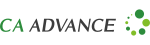

# OWASP Okinawaチャプターのホームページへようこそ

OWASP - Open Web Application Security Project とは、Webをはじめとするソフトウェアのセキュリティ環境の現状、またセキュアなソフトウェア開発を促進する技術・プロセスに関する情報共有と普及啓発を目的としたプロフェッショナルの集まる、オープンソース・ソフトウェアコミュニティです。The OWASP Foundationは、NPO団体として全世界のOWASPの活動を支えています。

OWASP Okinawaチャプターは日本で6番目に発足したローカルチャプターです。

## Owasp Okinawaに参加するには

* OWASP Okinawaが主催・参画するイベントに、どうぞご参加ください。
* ローカルチャプターミーティングとして、およそ、3ヶ月に一度の頻度でイベントを開催しています。
* [OWASP Okinawaメーリングリスト](https://groups.google.com/a/owasp.org/forum/#!forum/okinawa-chapter/join)に参加してください。イベント開催情報の告知などが行われます。
    * [Googleグループ](https://groups.google.com/a/owasp.org/d/forum/okinawa-chapter)に移行する前のメールアーカイブは[こちら](http://lists.owasp.org/pipermail/owasp-okinawa/)です。
* ソーシャル・ネットワークもあります。
    * Twitter: [@OwaspOkinawa](https://twitter.com/owaspokinawa)
    * Facebook: [OWASP Okinawa](https://www.facebook.com/owaspokinawa/)
* [Code of Conduct](/www-policy/operational/code-of-conduct.html)

## メーリングリストへの参加方法

* メーリングリストに参加したいGoogleアカウント(@owasp.orgや@gmail.comなど)でログインした状態で[OWASP Okinawaメーリングリスト](https://groups.google.com/a/owasp.org/forum/#!forum/okinawa-chapter/join)にアクセスして「グループへの参加を申し込む」をクリックしてください。あるいは[このリンク](https://groups.google.com/a/owasp.org/forum/#!forum/okinawa-chapter/join)をクリックしてください。
* Googleアカウントをお持ちでない場合は okinawa-chapter+subscribe＠owasp.org 宛にメールを送信してください(＠を半角@に変換してください)。その後届くメールに返信することで参加のリクエストが送信されます。残念ですが購読を止めたい場合は okinawa-chapter+unsubscribe＠owasp.org 宛にメールを送信してください(＠を半角@に変換してください)

それぞれの参加方法の詳細はこちらの資料をご確認ください(日本語翻訳の作成に感謝します)  
<https://docs.google.com/document/d/1sSZQRYZvsBbvu9c-okKID53RlmIc79xS8zRRnguR1uk>

## 次回のイベント

OWASP OkinawaはOWASP Eveningとして、セミナーや持ち込みのライトニングトークの形で行われる、Webセキュリティに関心のある方が集う、楽しくカジュアルな勉強会を開催しています。スキル、役職、業種、国籍、性別、年齢関係なく、遠慮なくお越しください。およそ、3ヶ月に一度の頻度で、このミーティングを開催しています。

新型コロナウイルス(COVID-19)の流行のため、2020年3月に予定していたイベントは中止しました。次回のイベントについては調整中です。  
開催が決まり次第、このページやメーリングリスト、Facebook、Twitterで告知いたします。

## 会員制度 / チャプタースポンサーシップ

OWASPの各Projectやチャプターの活動はリーダーを含めすべて無報酬のボランティアにより成り立っています。これらはメンバーシップ会費やチャプターサポーターによるスポンサーなどのコントリビューションによって賄われています。

ローカルチャプターのスポンサーはOWASP Foundationを通してお申し込みください。詳細は[Chapters](/www-policy/operational/chapters.html)ページの[Chapter Sponsors](/www-policy/operational/chapters.html#chapter-sponsors--local-and-global)をご確認ください。皆様のご支援を歓迎しています。

また、個人会員、企業会員、またアカデミックサポーターになることの価値についてもぜひご検討ください。

OWASP Okinawaチャプターは個人会員の皆様や下記の企業様、学校様のご支援を頂いています。お礼申し上げます。

The OWASP Foundation is very grateful for the support by the individuals and organizations listed. However please note, the OWASP Foundation is strictly vendor neutral and does not endorse any of its supporters.

### Local Chapter Supporter

Local Chapter Supporterとして下記の企業様にご支援を頂いています。

<table class="local-chapter-supporter">
<tbody>
    <tr>
        <td><a href="https://www.cyberagent.co.jp/" target="_blank" rel="noopener sponsored"> 株式会社サイバーエージェント</a> 様</td>
        <td><a href="https://www.ca-adv.co.jp/" target="_blank" rel="noopener sponsored"> 株式会社シーエー・アドバンス</a> 様</td>
    </tr>
</tbody>
</table>

### Single Meeting Supporter

過去1年間にイベント会場のご支援を頂いた企業様、学校様です。

* [株式会社モノクラム](https://www.monocram.co.jp/){:target="_blank"}{:rel="noopener sponsored"} 様

### List of Donors

[Donate](/donate/?reponame=www-chapter-okinawa&title=OWASP+Okinawa)ページで"Publicly list me as a supporter of OWASP Okinawa"を選択して寄付していただいた方々のリストです。



* {{ donor | strip_html | strip }}


### 各種会員制度、寄付、支援について

さまざまな会員の種類や支援の種類があります。詳細は[Membership](/www-policy/operational/membership.html)をご覧ください。

* [Individual Membership(個人)](/membership/): 50ドル(年間)、500ドル(ライフタイム)
    * owasp.orgメールアドレス付与(メンバーシップが有効な間のみ)。
    * 会員限定のニュース配信。
    * OWASPの組織の投票への参加。
    * 学生あるいは地域によっては割引もあります。
* [Corporate Membership(企業・団体)](/supporters/): 5000ドル(年間)から。詳細はリンク先をご確認ください。
    * owasp.orgサイト全体でCorporate Supporterとしてローテーションでロゴの掲載が行われます(ページ下部参照)。
    * OWASPグローバルイベントにおける特典。
* [Local Chapter Supporter(企業・団体)](/www-policy/operational/chapters.html#chapter-sponsors--local-and-global): 500ドル(年間)から。
    * **2020/09/12現在、ポリシーの見直しが行われています。内容は変更になる可能性があります。**
    * このページに少なくとも1年間はロゴの掲示、リンクの設置をいたします。
    * イベントのオープニング時にLocal Chapter Supporterとしてロゴと企業名あるいは団体名を紹介いたします。
    * [Donations](/www-policy/operational/donations.html)もご一読下さい。
* [Single Meeting Supporter(会場支援)](/www-policy/operational/chapters.html#chapter-sponsors--local-and-global)
    * **2020/09/12現在、ポリシーの見直しが行われています。内容は変更になる可能性があります。**
    * このページに少なくとも1年間はリンクの設置をいたします。
    * イベントのオープニング時にSingle Meeting Supporterとしてロゴと企業名あるいは団体名を紹介いたします。
* [その他の支援](/www-policy/operational/chapters.html#chapter-sponsors--local-and-global):
    * **2020/09/12現在、ポリシーの見直しが行われています。内容は変更になる可能性があります。**
    * [OWASPへの寄付](/donate/?reponame=www-chapter-okinawa&title=OWASP+Okinawa)。上記の[Donations](/www-policy/operational/donations.html)もご一読下さい。
    * 有償の貢献だけでなく、あなたのプロジェクト参画やイベント参加もOWASPへの貢献になり、歓迎します。
    * Chapter Meetingの会場をお貸しいただける企業様、スピーカーを務めて頂ける方、その他ご協力頂ける方はぜひ私たちまでご連絡ください。
    * スピーカー希望の方は[Speaker Agreement](/www-policy/legal/speaker-agreement.html)([日本語訳](https://www.owasp.org/index.php/Speaker_Agreement:%E6%97%A5%E6%9C%AC%E8%AA%9E%E8%A8%B3))をご一読下さい。
